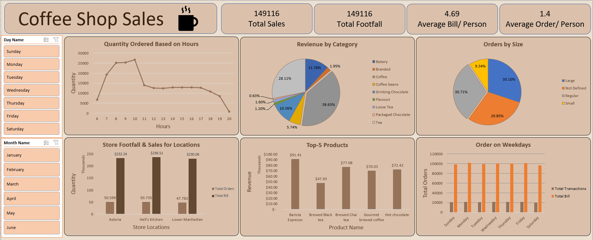

# Coffee Shop Sales Data Analysis and Visualization

This project involves the analysis and visualization of a coffee shop's sales data using Excel and Power Query. The goal is to explore sales patterns and trends, providing actionable insights through data transformation and visualizations.

## Dataset
The dataset used for this analysis can be accessed [here]([https://mavenanalytics.io/data-playground?page=6&pageSize=5]), Dataset is named ***Coffee Shop Sales*** and also uploaded in the same repository for your ease.

## Project Overview
- **Data Transformation**: The raw data was cleaned, transformed, and organized using Excel and Power Query to ensure consistency and readiness for analysis.
- **Visualizations**: Various visualizations were created in Excel to present the sales trends, customer preferences, and key business metrics in a comprehensive and easily digestible format.

## Analysis Report
Detailed answers to several analysis questions can be found in the PDF file [Coffee Shop Sales Analysis.pdf].

## Final Dashboard
The final dashboard summarizing the key insights is shown below:

## Excel Source File
The full analysis and dashboard summarizing the key insights is available in the Excel file [Coffee Shop Sales Analysis.xlsx]. Keep in mind, Excel file is protected with a personal password, so, you can only read it but can't edit or change its content.

## Contact
If you have any questions or would like to discuss the project, feel free to reach out via email at 785.mohsin.muhammad@gmail.com.
